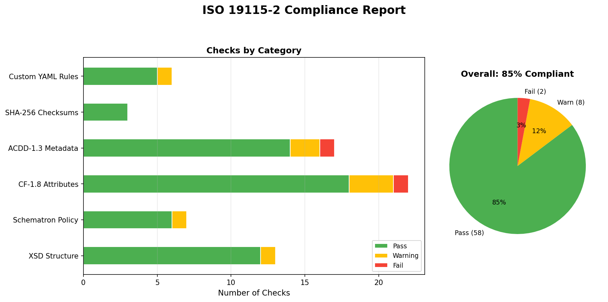
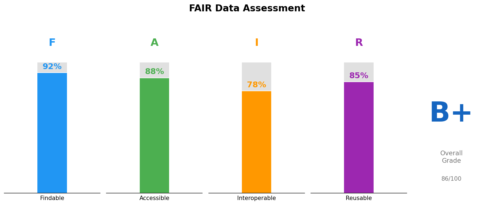

# iso19115-validator

**CLI and web-based metadata linter for ISO 19115-2, CF-1.8, and ACDD-1.3 geospatial standards.**

Validates XML metadata records and NetCDF file attributes against international standards, institutional policies, and FAIR data principles — entirely offline, with no external API calls.

[](https://github.com/ranjithguggilla/iso19115-validator/actions)
[](https://python.org)
[](LICENSE)





---

## Why This Exists

Geospatial data repositories require metadata that conforms to ISO 19115-2, the Climate and Forecast (CF) Conventions, and the Attribute Convention for Data Discovery (ACDD). Manual metadata review is tedious and error-prone. Existing validators are often online-only, focused on a single standard, or lack actionable fix suggestions.

`isolint` combines structural validation (XSD), policy enforcement (Schematron), convention checking (CF/ACDD), and custom institutional rules (YAML DSL) into a single offline tool with exact XPath error locations and concrete fix suggestions.

---

## Features

| Capability | Description |
|---|---|
| **XSD structural validation** | Checks required/recommended ISO 19115-2 elements with XPath locations |
| **Schematron policy rules** | Validates dates, geographic bounds, topic categories, URLs, abstracts |
| **CF-1.8 convention checking** | Inspects NetCDF global and variable attributes against CF standard |
| **ACDD-1.3 compliance** | Checks required/recommended/suggested discovery attributes |
| **YAML rules DSL** | Define custom institutional policies without writing Python |
| **SHA-256 checksum verification** | Validates MANIFEST.sha256 and per-file sidecar checksums |
| **FAIR self-scoring** | Scores Findable/Accessible/Interoperable/Reusable with letter grade |
| **Metadata diff** | Compares two XML or NetCDF files and reports structural differences |
| **Auto-suggestions** | Generates prioritized improvement recommendations |
| **FastAPI web UI** | Browser-based drag-and-drop validation dashboard |
| **Multiple output formats** | Text (Rich terminal), JSON, Markdown compliance reports |
| **Fully offline** | No external API calls, no telemetry, no network required |

---

## Architecture

```
                    ┌──────────────────────────────────────┐
                    │            isolint CLI                │
                    │  check · suggest · diff · fair · serve│
                    └──────────┬───────────────────────────┘
                               │
                    ┌──────────▼───────────────────────────┐
                    │        ValidationEngine               │
                    │  orchestrates all validation layers   │
                    └──┬────┬────┬────┬────┬───────────────┘
                       │    │    │    │    │
           ┌───────────┘    │    │    │    └──────────┐
           ▼                ▼    ▼    ▼               ▼
    ┌──────────┐   ┌─────┐ ┌──┐ ┌────┐    ┌──────────────┐
    │   XSD    │   │Sch- │ │CF│ │ACDD│    │  YAML Rules  │
    │Validator │   │ematron│ │  │ │    │    │    Engine    │
    └──────────┘   └──────┘ └──┘ └────┘    └──────────────┘
           │           │      │     │              │
           └───────────┴──────┴─────┴──────────────┘
                               │
                    ┌──────────▼───────────────────────────┐
                    │       ComplianceReport                │
                    │  findings · JSON · Markdown · Rich    │
                    └──────────────────────────────────────┘
```

---

## Quick Start

### Installation

```bash
# From source
git clone https://github.com/ranjithguggilla/iso19115-validator.git
cd iso19115-validator
pip install -e ".[dev]"

# Verify installation
isolint --version
```

### Validate Metadata

```bash
# Validate an ISO 19115-2 XML file
isolint check metadata.xml

# Validate a directory of metadata + NetCDF files
isolint check /path/to/data/package/

# Get JSON report
isolint check metadata.xml --format json -o report.json

# Get Markdown report
isolint check metadata.xml --format markdown -o report.md

# Apply custom institutional rules
isolint check metadata.xml --rules my_rules.yaml
```

### Get Improvement Suggestions

```bash
isolint suggest metadata.xml
isolint suggest /path/to/data/ --format json
```

### Compare Two Metadata Files

```bash
isolint diff old_metadata.xml new_metadata.xml
isolint diff v1.nc v2.nc --format json
```

### Compute FAIR Score

```bash
isolint fair metadata.xml
isolint fair /path/to/data/ --format json
```

### Start Web UI

```bash
isolint serve
# Opens at http://127.0.0.1:8000
```

---

## How It Works — Step by Step

### Step 1: File Discovery

When pointed at a directory, the engine scans for:
- `*.xml` → ISO 19115-2 validation (XSD + Schematron)
- `*.nc` → CF-1.8 + ACDD-1.3 attribute checking
- `*.sha256` → Checksum verification

### Step 2: XSD Structural Validation

For each XML file, the validator checks:

1. **Well-formedness** — Can lxml parse the document without errors?
2. **Required elements** — Are `fileIdentifier`, `language`, `contact`, `dateStamp`, and `identificationInfo` present?
3. **Recommended elements** — Are `abstract`, `topicCategory`, `extent`, and `dataQualityInfo` present?
4. **Namespace declarations** — Does the root element declare ISO TC211 namespaces?

Each finding includes the exact XPath to the offending (or missing) element.

### Step 3: Schematron Policy Rules

Seven semantic assertions enforce data quality beyond structure:

| Rule | Check | Severity |
|------|-------|----------|
| SCH-001 | Date stamps use ISO 8601 format | Error |
| SCH-002 | Geographic bounding box coordinates are valid | Error |
| SCH-003 | Topic categories from controlled vocabulary | Error |
| SCH-004 | Online resource URLs are well-formed | Warning |
| SCH-005 | Responsible party has name (org or individual) | Warning |
| SCH-006 | No empty `gco:CharacterString` elements | Warning |
| SCH-007 | Abstract is at least 50 characters | Warning |

### Step 4: CF-1.8 Convention Checking

For NetCDF files, the checker inspects:

- **Global attributes**: `Conventions` must reference CF; `title` is required
- **Variable attributes**: Each data variable needs `standard_name` or `long_name` plus `units`
- **Coordinate variables**: Must have `units`; `time` should have `calendar`
- **Standard names**: Validated against a curated lookup table of common oceanographic names

### Step 5: ACDD-1.3 Compliance

Three-tier attribute classification:

- **Required** (4 attrs): `title`, `summary`, `keywords`, `Conventions`
- **Recommended** (16 attrs): Including `creator_name`, `license`, `geospatial_*`, `time_coverage_*`
- **Suggested** (14 attrs): Including `publisher_*`, `platform`, `instrument`

Cross-attribute consistency: lat min < lat max, time start < time end.

### Step 6: Custom Rules (YAML DSL)

Organizations define rules in YAML without writing Python:

```yaml
rules:
  - id: INST-001
    description: "Dataset must have a DOI"
    severity: error
    check:
      type: xpath_exists
      xpath: "//gmd:identifier//gco:CharacterString[starts-with(., '10.')]"
    suggestion: "Register with DataCite or Zenodo."

  - id: INST-002
    description: "License must be specified in NetCDF"
    severity: error
    check:
      type: attr_exists
      attribute: license
    suggestion: "Add license='CC-BY-4.0' to NetCDF global attributes."
```

**Available rule types:**
- `xpath_exists` — XML element must exist
- `xpath_not_empty` — XML element must have content
- `xpath_regex` — XML element text must match regex pattern
- `attr_exists` — NetCDF global attribute must exist
- `attr_regex` — NetCDF attribute value must match regex
- `file_exists` — Named file must exist in directory

### Step 7: Report Generation

Reports are produced in three formats:

**Rich terminal** (default) — colored severity indicators, XPath locations, fix suggestions

**JSON** — machine-readable for CI/CD integration:
```json
{
  "target": "metadata.xml",
  "passed": false,
  "summary": {"errors": 3, "warnings": 2, "info": 4},
  "findings": [
    {
      "severity": "error",
      "message": "Required element missing: gmd:contact",
      "xpath": "//gmd:contact",
      "rule_id": "XSD-010",
      "suggestion": "Add the required element gmd:contact."
    }
  ]
}
```

**Markdown** — for documentation and pull request comments

---

## FAIR Self-Scoring

The FAIR scorer evaluates metadata against the four FAIR principles:

| Principle | What's Checked |
|-----------|---------------|
| **F**indable | Unique identifier, rich metadata (title/abstract/keywords), dataset ID |
| **A**ccessible | Online resource URLs, contact information |
| **I**nteroperable | XML namespaces, vocabulary references, cross-dataset links |
| **R**eusable | License/constraints, provenance/lineage, community standards |

Each principle scores 0.0–1.0. The overall score is the mean of all four. Letter grades: A (≥90%), B (≥80%), C (≥70%), D (≥60%), F (<60%).

```
FAIR Score: 46% (Grade: F)

  Findable       ████████░░░░░░░░░░░░ 44%
  Accessible     ██████████░░░░░░░░░░ 50%
  Interoperable  ██████░░░░░░░░░░░░░░ 33%
  Reusable       ██████████░░░░░░░░░░ 50%
```

---

## YAML Rules DSL

The YAML rules DSL lets institutions define custom validation policies without touching Python. Rules are loaded at runtime and applied alongside the built-in checks.

### Built-in Rule Sets

| Rule Set | File | Description |
|----------|------|-------------|
| Oceanographic | `isolint/rules/oceanographic.yaml` | Rules for marine observation datasets |
| Institutional | `isolint/rules/institutional.yaml` | Template for organizational policies |

### Writing Custom Rules

Create a YAML file:

```yaml
name: my-organization
version: "1.0"

rules:
  - id: ORG-001
    description: "File identifier must use our naming convention"
    severity: error
    check:
      type: xpath_regex
      xpath: "//gmd:fileIdentifier/gco:CharacterString"
      pattern: "^ORG-\\d{4}-\\d+"
    suggestion: "Use format ORG-YYYY-NNN."

  - id: ORG-002
    description: "README must be present in data package"
    severity: warning
    check:
      type: file_exists
      filename: "README.txt"
    suggestion: "Include a README.txt."
```

Apply with:
```bash
isolint check /data/package --rules my_rules.yaml
```

---

## Web UI

Start the FastAPI dashboard:

```bash
isolint serve --port 8000
```

**Endpoints:**

| Method | Path | Description |
|--------|------|-------------|
| GET | `/` | HTML dashboard with drag-and-drop upload |
| POST | `/validate` | Validate uploaded files |
| POST | `/suggest` | Get improvement suggestions |
| POST | `/fair` | Compute FAIR score |
| GET | `/health` | Health check |

The web UI is a single-page application with a dark theme. Upload XML or NetCDF files, click Validate/Suggest/FAIR Score, and see results inline.

---

## Project Structure

```
iso19115-validator/
├── isolint/                    # Core package
│   ├── __init__.py             # Package exports
│   ├── engine.py               # ValidationEngine — orchestrates all layers
│   ├── report.py               # ComplianceReport and Finding models
│   ├── xsd_validator.py        # XSD structural validation
│   ├── schematron.py           # Schematron policy rules
│   ├── cf_checker.py           # CF-1.8 convention checker
│   ├── acdd_checker.py         # ACDD-1.3 compliance checker
│   ├── checksum_validator.py   # SHA-256 manifest verification
│   ├── yaml_rules.py           # YAML rules DSL engine
│   ├── fair.py                 # FAIR self-scoring module
│   ├── diff.py                 # Metadata diff engine
│   ├── suggest.py              # Auto-suggestion engine
│   ├── cli.py                  # Click CLI (check, suggest, diff, fair, serve)
│   ├── web.py                  # FastAPI web interface
│   ├── rules/                  # Built-in YAML rule sets
│   │   ├── oceanographic.yaml  # Marine observation rules
│   │   └── institutional.yaml  # Template for organizational policies
│   └── schemas/                # Schema references
├── tests/                      # 93 tests across 9 modules
│   ├── conftest.py             # Shared fixtures
│   ├── test_xsd_validator.py   # XSD validation tests
│   ├── test_schematron.py      # Schematron policy tests
│   ├── test_report.py          # Report model tests
│   ├── test_checksum.py        # Checksum verification tests
│   ├── test_yaml_rules.py      # YAML DSL tests
│   ├── test_fair.py            # FAIR scoring tests
│   ├── test_diff.py            # Diff engine tests
│   ├── test_suggest.py         # Suggestion engine tests
│   ├── test_engine.py          # Integration tests
│   ├── test_cli.py             # CLI command tests
│   └── test_web.py             # FastAPI endpoint tests
├── examples/                   # Sample metadata files
│   ├── valid_metadata.xml      # Complete ISO 19115-2 record
│   ├── incomplete_metadata.xml # Deliberately incomplete (for testing)
│   └── sample_rules.yaml       # Example YAML rules
├── docs/
│   ├── METHODS.md              # Technical methods documentation
│   ├── sample_report_valid.json
│   ├── sample_report_incomplete.json
│   └── sample_fair_score.md
├── scripts/
│   └── generate_sample_report.py
├── .github/workflows/ci.yml   # CI: lint + test matrix + build
├── pyproject.toml              # Project metadata and dependencies
├── Makefile                    # Development shortcuts
├── CHANGELOG.md                # Version history
└── LICENSE                     # MIT
```

---

## Validation Rule Reference

### XSD Rules (XSD-xxx)

| Rule ID | Severity | Description |
|---------|----------|-------------|
| XSD-001 | Error | XML syntax error |
| XSD-002 | Warning | Root element not MD_Metadata or MI_Metadata |
| XSD-010 | Error | Required element missing |
| XSD-011 | Warning | Required element is empty |
| XSD-020 | Info | Recommended element missing |
| XSD-030 | Warning | No ISO TC211 namespaces declared |

### Schematron Rules (SCH-xxx)

| Rule ID | Severity | Description |
|---------|----------|-------------|
| SCH-001 | Error | Invalid ISO 8601 date format |
| SCH-002 | Error | Invalid geographic bounding box |
| SCH-003 | Error | Invalid topic category |
| SCH-004 | Warning | Malformed online resource URL |
| SCH-005 | Warning | Responsible party missing name |
| SCH-006 | Warning | Empty CharacterString elements |
| SCH-007 | Warning | Abstract too short (< 50 chars) |

### CF Convention Rules (CF-xxx)

| Rule ID | Severity | Description |
|---------|----------|-------------|
| CF-010 | Error | Missing required CF global attribute |
| CF-011 | Info | Missing recommended CF global attribute |
| CF-012 | Warning | Conventions attribute doesn't reference CF |
| CF-020 | Warning | Variable lacks standard_name and long_name |
| CF-021 | Info | Unrecognized standard_name |
| CF-022 | Warning | Variable missing units attribute |
| CF-030 | Error | Coordinate variable missing units |
| CF-031 | Info | Time coordinate missing calendar |

### ACDD Rules (ACDD-xxx)

| Rule ID | Severity | Description |
|---------|----------|-------------|
| ACDD-010 | Error | Missing required ACDD attribute |
| ACDD-011 | Warning | Required ACDD attribute is empty |
| ACDD-020 | Warning | Missing recommended ACDD attributes |
| ACDD-030 | Info | Missing suggested ACDD attributes |
| ACDD-040 | Error | Geospatial lat min > max |
| ACDD-041 | Error | Latitude out of range |
| ACDD-042 | Error | Longitude out of range |
| ACDD-050 | Error | Time coverage start > end |

### Checksum Rules (CHK-xxx)

| Rule ID | Severity | Description |
|---------|----------|-------------|
| CHK-001 | Warning | Malformed checksum line |
| CHK-002 | Error | Referenced file not found |
| CHK-003 | Error | Checksum mismatch |
| CHK-100 | Info | Verification summary |

---

## Development

```bash
# Install with dev dependencies
pip install -e ".[dev]"

# Run tests
make test

# Run tests with coverage
make test-cov

# Lint
make lint

# Validate example metadata
make check

# Generate sample reports
make sample
```

---

## Testing

93 tests across 9 test modules covering:

- **XSD validation**: well-formedness, required/recommended elements, namespaces
- **Schematron rules**: date formats, geographic bounds, topic categories, URLs, abstracts
- **Report model**: finding serialization, JSON/Markdown rendering, pass/fail logic
- **Checksum validation**: valid/invalid digests, missing files, manifest format
- **YAML rules**: rule loading, XPath evaluation, regex matching, file existence, disabled rules
- **FAIR scoring**: score computation, grading, XML/NetCDF scoring
- **Diff engine**: identical files, added/removed/changed elements, malformed input
- **Suggestion engine**: XML suggestions, directory scanning, priority sorting
- **CLI**: all commands (check, suggest, diff, fair), all output formats, file output
- **Web API**: dashboard, validate, suggest, FAIR endpoints

```bash
pytest tests/ -v
# ============================== 93 passed ==============================
```

---

## Security

- **Offline-only**: No external API calls, no telemetry, no data leaves your machine
- **No code execution from metadata**: XML parsing uses lxml with no XSLT or script evaluation
- **Input validation**: All user inputs sanitized through Click parameter types
- **Temp file cleanup**: Web uploads use Python's `tempfile` with automatic cleanup
- **No secrets required**: Works without any API keys or tokens

---

## References

- ISO 19115-2:2019 — Geographic information — Metadata — Part 2
- CF Metadata Conventions v1.8 (2020). http://cfconventions.org/
- ACDD 1.3 (2015). https://wiki.esipfed.org/ACDD_1.3
- FAIR Data Principles (Wilkinson et al., 2016). doi:10.1038/sdata.2016.18
- ISO/IEC 19757-3:2020 — Schematron

---

## License

MIT — see [LICENSE](LICENSE).
